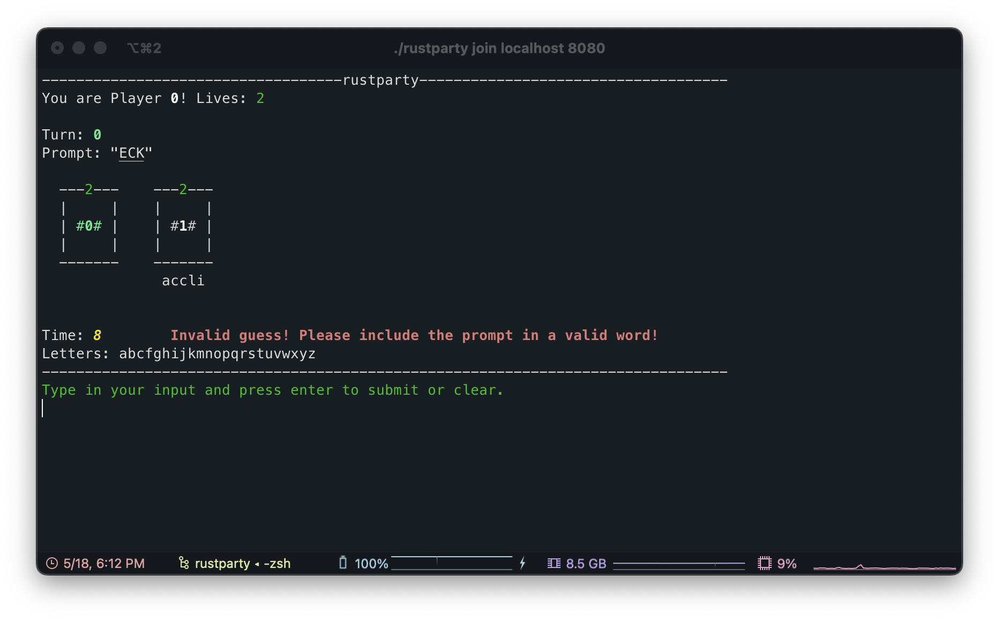
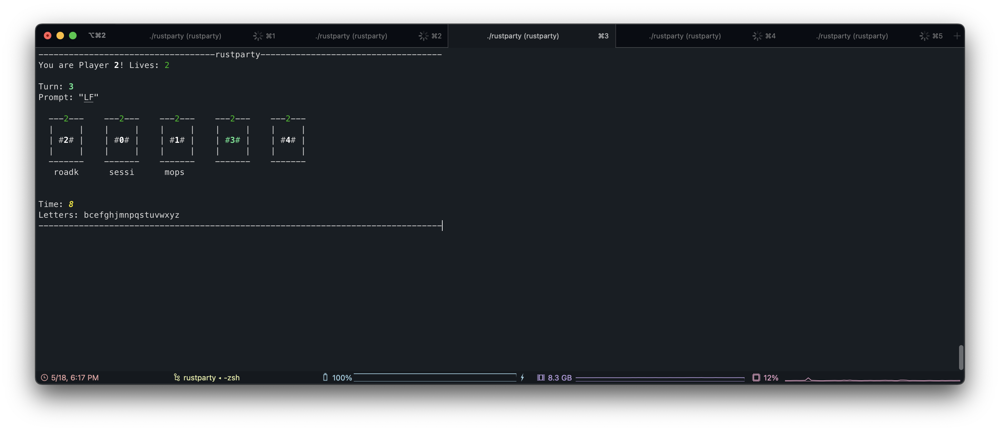
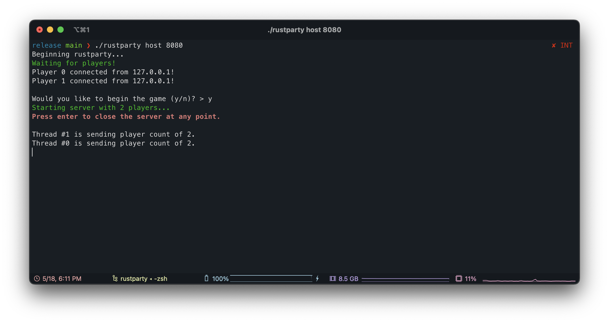

# rustparty

A networked, CLI version of the online game Bombparty written entirely in Rust. Enables up to 8 players to attempt to match words to a prompt within a timer until somebody runs out of lives.

The original game is located [here](https://jklm.fun).
## Installation

> rustparty is not tested on Windows. If not functional, try WSL. Installation can be found [here](https://docs.microsoft.com/en-us/windows/wsl/install).

To install, just download the binary and add it to your path. For example:

### Oh My Zsh
`mkdir ~/.rustparty/`

`curl https://github.com/erakai/rustparty/blob/main/target/release/rustparty?raw=true >> ~/.rustparty/rustparty`

`export PATH=~/.rustparty/:$PATH`

### 

## Contributors
- Kai Tinkess

## Screenshots

